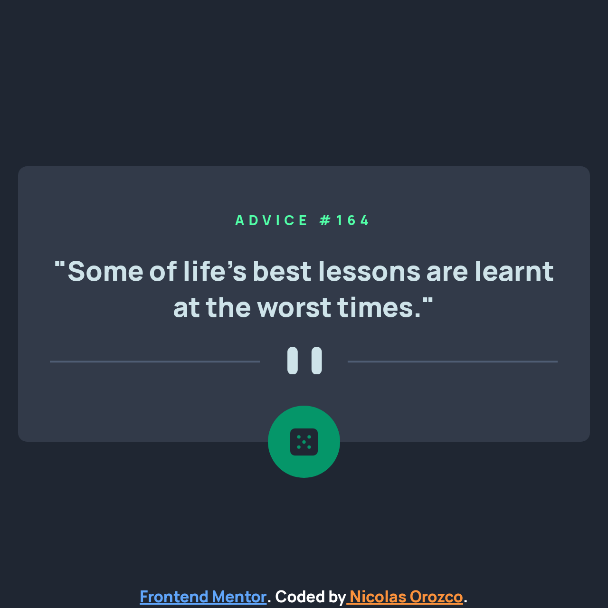

# Frontend Mentor - Advice generator app solution

This is a solution to the [Advice generator app challenge on Frontend Mentor](https://www.frontendmentor.io/challenges/advice-generator-app-QdUG-13db). Frontend Mentor challenges help you improve your coding skills by building realistic projects.

## Table of contents

- [Overview](#overview)
  - [The challenge](#the-challenge)
  - [Screenshot](#screenshot)
  - [Links](#links)
- [My process](#my-process)
  - [Built with](#built-with)
  - [What I learned](#what-i-learned)
  - [Continued development](#continued-development)
  - [Useful resources](#useful-resources)
- [Author](#author)

## Overview

Good looking Advice Generator with React, Axios and Tailwind CSS

### The challenge

Users should be able to:

- View the optimal layout for the app depending on their device's screen size
- See hover states for all interactive elements on the page
- Generate a new piece of advice by clicking the dice icon

### Screenshot

### Links

- Solution URL: [Here](https://github.com/Nicolas-Orozco/frontend-mentor-advice-generator)
- Live Site URL: [Here](https://frontend-mentor-advice-generator-lime.vercel.app/)

## My process

Mainly, my progress is in the develop branch, [Here](https://github.com/Nicolas-Orozco/frontend-mentor-advice-generator/commits/develop)

### Built with

- Semantic HTML5 markup
- Flexbox
- Mobile-first workflow
- [PostCSS](https://postcss.org/) - CSS-JS Tool
- [React](https://reactjs.org/) - JS library
- [Tailwind CSS](https://tailwindcss.com/) - For styles
- [Axios](https://axios-http.com/) - For fetch
- [Axios-Hooks](https://github.com/simoneb/axios-hooks) - For loading and error states

### What I learned

-Use of arbitrary properties with Tailwind CSS
-Manage states with Axios Hooks library
-Context, useContext and useMemo hook

### Continued development

Improve accessibility and semantic HTML for a better experience.

### Useful resources

- [CSS Glow Generator](https://cssbud.com/css-generator/css-glow-generator/) - This helped me making a glow effect when the dice button is hovered.
- [Tailwind guide for adding custom styles](https://tailwindcss.com/docs/adding-custom-styles) - This will be crucial for me when making the advice divider change image and size, also for adding other colors.
- [Article about React Context and Hook guide](https://www.savaslabs.com/blog/using-react-global-state-hooks-and-context#spanspanspanstrongspanspan4-create-an-objectspanspanstrongspanspanspan) - With this I learned about the manage of context, passed values and useContext hook in child components.
- [Article about useMemo](https://dmitripavlutin.com/react-usememo-hook/) - For memoizing Context values and improving performance.
- [Axios Hooks Github page](https://github.com/simoneb/axios-hooks) - This helped me while learning and practicing about the states of a fetch request with Axios.

## Author

- Github - [Nicolas Orozco Davila](https://github.com/Nicolas-Orozco)
- Frontend Mentor - [@Nicolas-Orozco](https://www.frontendmentor.io/profile/Nicolas-Orozco)
